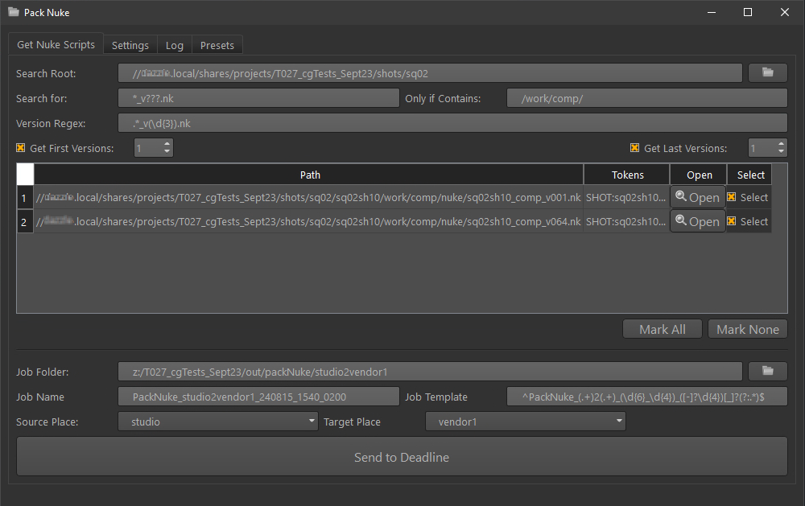

# Pack Nuke

Pack Nuke is a tool that collects and relink all files required to make Nuke script work on another machine.
It works with AWS Deadline render farm, and is aimed for studio to studio exchange.

First, you select the Nuke scripts you want to pack, together with all the settings needed.
Then the actual Nuke script collection is processed on farm, each script is executed as separate Deadline Job.
When finished, each Deadline packing job generates report in the packing folder.

## To Do
* multi-shot deduplication for each package (for now, if media is used in 10 Nuke scripts, it is copied 10 times).
* ingest script that compares current Nuke script (let's say v10 from Vendor) with old script (maybe v0 from studio), copies v10 to the same folder as v0, and relinks media already present in v0 to v10 script (by comparing file extension, number of files in the file sequence, and hashes)
* option to skip packing files that "the other place" already has
* code cleanup, can be simplified a lot...
* the gui is very rough, needs a lot of attention
* Ayon integration, that will replace the gui part

## Pack Nuke Script
Python script to be run in Nuke. It opens Nuke script, gathers all the files info, deduplicates the files, copies files to package folder, saves Nuke script to package, and relinks to copied files.

Saves the report in package folder as well.

## Pack Nuke Gui
Helps to select the Nuke scripts to be packed. It recursively searches for Nuke scripts with basic filtering.
Version regex parses version from the found *.nk path. You can further filter to only include first x and / or last n number of versions.
Found and filtered Nuke scripts are displayed in the spreadsheet for user select.

Job Folder together with Job Name construct the destination path.

Send to Deadline button saves the list of selected nuke scripts as .csv, and settings json from the Settings tab to the job folder, and sends each selected Nuke script to Deadline for processing.

### Settings

#### Settings - Places
Each place can be a source and / or target of the package.
The Anatomy section stores arbitrary info about the place.
The Script Path Tags allows to parse Nuke script path to arbitrary number of custom tags.
The Anatomy and Script Path Tags can help to define path templates.

#### Settings - Job
Template for job name. place_source and place_target tags are taken from the gui. 
The timestamp tag has fixed format of current UTC time and offset, to facilitate package sorting across the timezones.

#### Categories
Categories help to group files required by Nuke script. This allows to heavily customize the folder structure of the package.
You can define arbitrary number of media file categories, each with filtering by regex parsing the path/name, or Nuke node Class.
Each category filter can add token name & value pair.
Each category also has option to skip disabled or disconnected Nuke nodes.

The path root template plus top folder constructs the file destination in the package.

#### File Type Options
Fonts, Gizmos and OCIO are considered special kind of categories, with no filtering options.

#### Executables
Deadline and Nuke sections define the OS specific executables.

#### Deadline Python
OS specific location for pack_nuke.py that is needed for farm processing

#### Deadline Job
Controls the machines that will accept the pack nuke tasks.

#### Hashes
Allows to turn on the hash generation for packed files, to assist relinking.

#### Nuke Scripts
Controls Nuke script names and relative linking.

## Package Folder Structure
Package has always the _pack_nuke folder, that contains selected nuke scripts in nuke_files.csv, package settings.json, and report from each pack_nuke deadline job.

The rest of the folder structure is defined by the path section of categories.

## Setup
The settings.json is quite complex, please refer to the settings.json _comment keys for further info.

Many sections have path and path_relink keys. The path is used to copy from source to package. The _relink path can be used for ingesting at the target place. This might change...
